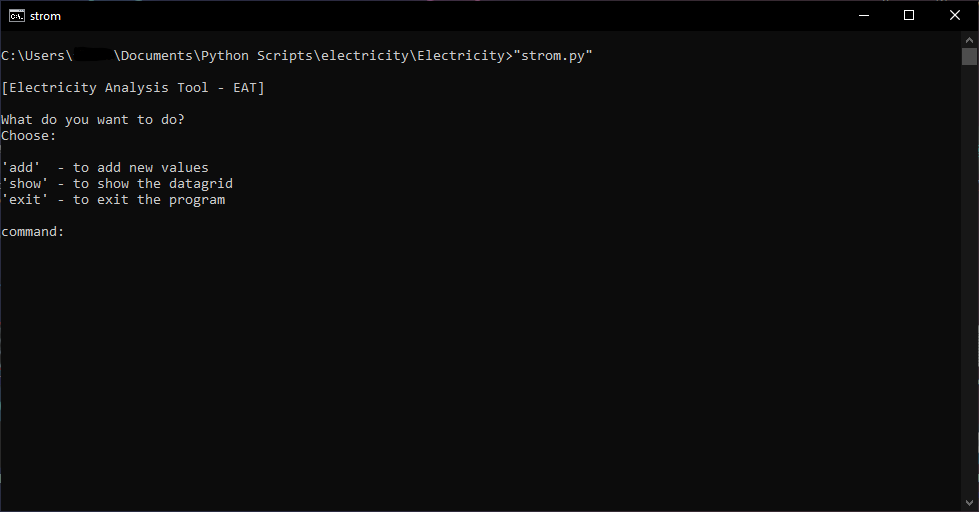
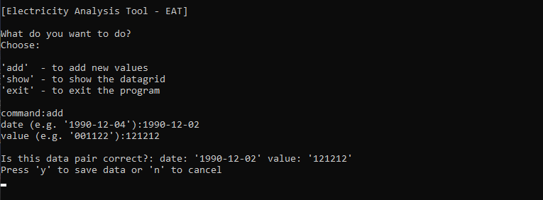
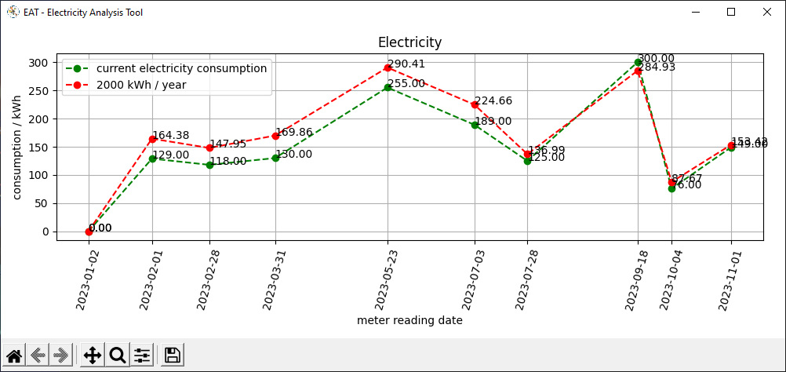

# Electricity Analysis Tool - EAT

## EAT - Main Screen
If your are using the commandline version, you will be shown this main screen. 

## EAT - Add Values
At this step, you can add some values e.g. a date and a 6 digits value

## EAT - Show
At this state, it's open a another window which visualizes your values.

